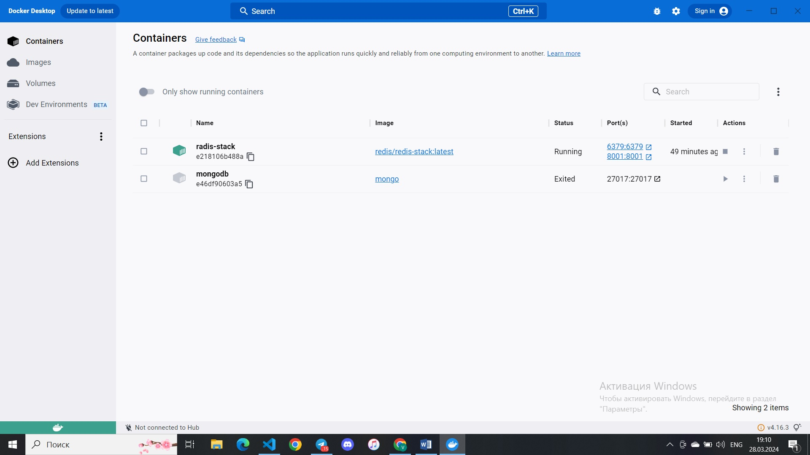
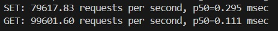

## 1. Развернули Redis в Docker


## 2. С помощью Python добали json файл в виде string, hset, list и zset
### zset:
```python
file = open("trade-indexes.json")

client = redis.Redis(host='localhost', port=6379, db=0)

data = json.load(file)
data_json_str = json.dumps(data)
start_time = time.time()

client.zadd('zset', {data_json_str : 1})

end_time = time.time()

file.close()
```
### string:
```python
file = open("trade-indexes.json")

client = redis.Redis(host='localhost', port=6379, db=0)

data = json.load(file)
data_json_str = json.dumps(data)
start_time = time.time()

client.set('string', data_json_str)

end_time = time.time()

file.close()

```
### hset:
```python
file = open("trade-indexes.json")

client = redis.Redis(host='localhost', port=6379, db=0)

data = json.load(file)

start_time = time.time()

for key, value in data.items():
    client.hset('hset', key, json.dumps(value))

end_time = time.time()

file.close()
```
### list:
```python
file = open("trade-indexes.json")

client = redis.Redis(host='localhost', port=6379, db=0)

data = json.load(file)
data_json_str = json.dumps(data)
start_time = time.time()

client.rpush('list', data_json_str)

end_time = time.time()

file.close()
```

Также, как видно, были проведены замеры времени загрузки:
| Тип      | Время              |
| ---------|:------------------:|
| string   | 1.422              |
| hset     | 0.965              |
| list     | 1.264              |
| zset     | 0.811              |

Прикрепляю скриншоты:


"Аналогичным" образом замерены времена загрузки(см. файл read_data.py):


## 3. Бенчмарк тесты
С помощью команды
```bash
redis-benchmark -t get,set -q
```
Замерили количество запросов в секунду для комманд SET и GET.
Получили след. результаты:


Пропускная способоность - 74 Кб/с

Следующая команда анализирует команды GET и SET с ключами размером в 1 МБ:
```bash
redis-benchmark -t set,get -d 1000000 -n 1000 -q
```
Результаты:

Пропускная способоность - ~100 Мб/с

## 3. Развернем кластер
Локально запустили 6 Redis серверов на разных портах(7000-7005). Далее соединили в один кластер с 3-мя мастерами и 3-мя 'slave'-ми:


Провели Benchmark тест:
```bash
redis-benchmark -p 7000 -t get,set -q --cluster
```
Получили результат:

